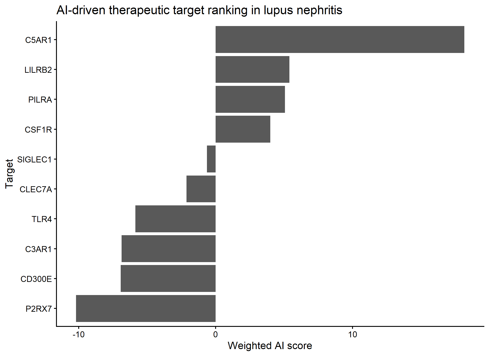
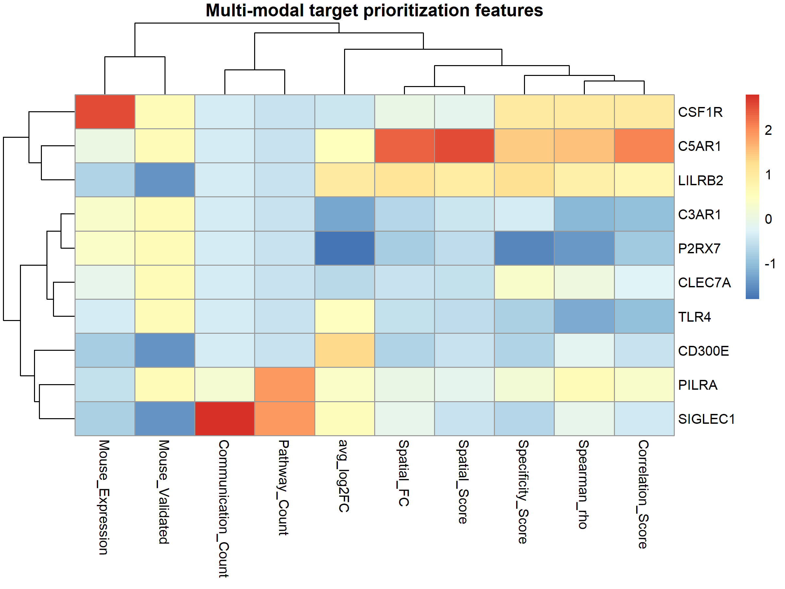
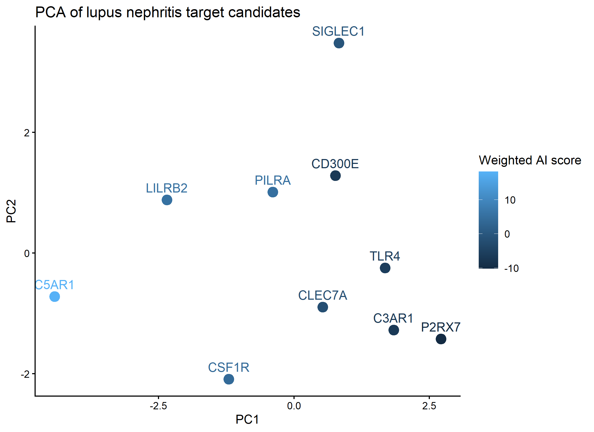
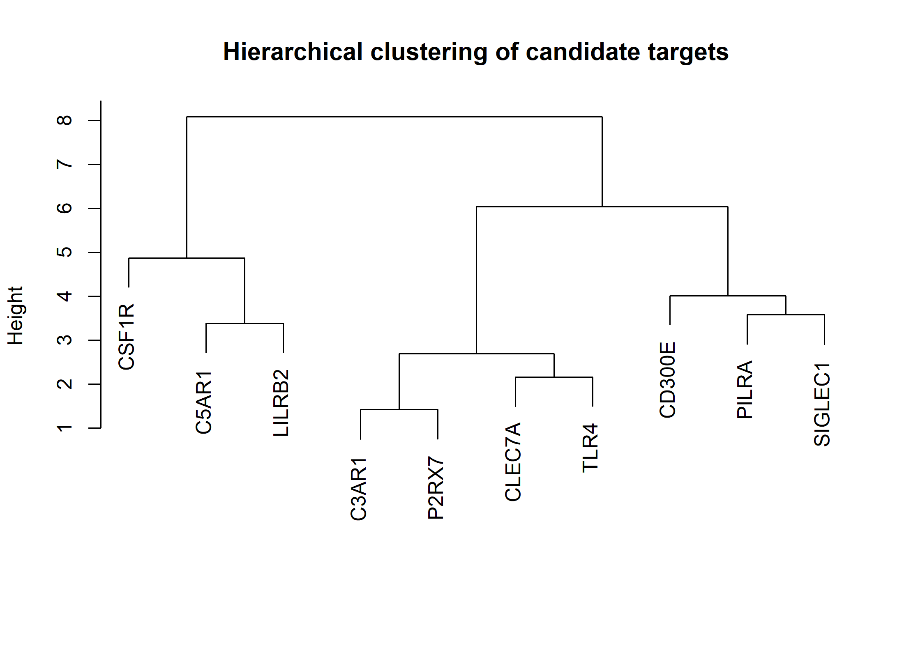
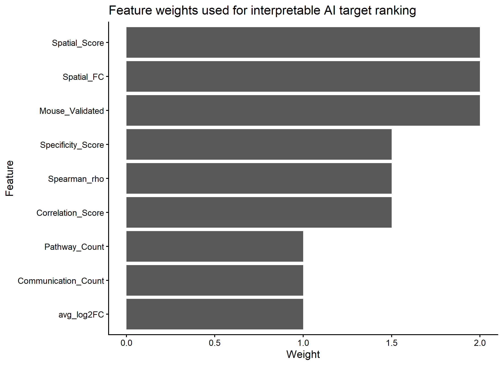

<p align="center">
  
</p>

<h1 align="center">
AI-Driven Therapeutic Target Prioritization in Lupus Nephritis
</h1>

<p align="center">


</p>

---

# Overview

This project presents an interpretable AI-driven framework for therapeutic target prioritization in lupus nephritis.

Rather than relying solely on differential gene expression, the workflow integrates multiple independent biological evidence sources into a machine-learning-inspired scoring framework to prioritize therapeutic targets with increased biological confidence.

The objective is to demonstrate how feature engineering and interpretable artificial intelligence can accelerate translational target discovery in autoimmune disease.

---

# Scientific Motivation

Drug discovery increasingly relies on integrating diverse biological datasets rather than analyzing individual experiments independently.

Genes identified from a single transcriptomic dataset often lack reproducibility and translational relevance.

This project addresses this challenge by integrating:

- Human single-cell RNA sequencing
- Mouse validation
- Human spatial transcriptomics
- Cell–cell communication analysis
- Machine-learning-inspired feature engineering

into a unified therapeutic target prioritization framework.

---

# Workflow

```text
Human Single-cell RNA Sequencing
             │
             ▼
Target Discovery
             │
             ▼
Mouse Validation
             │
             ▼
Human Spatial Validation
             │
             ▼
Cell–Cell Communication
             │
             ▼
Feature Engineering
             │
             ▼
AI Target Scoring
             │
             ▼
Target Ranking
             │
             ▼
Biological Interpretation
```

---

# Repository Structure

```text
scripts/
│
├── 01_build_feature_matrix.R
├── 02_unsupervised_target_analysis.R
├── 03_weighted_ai_scoring.R
└── 04_target_prioritization.R

figures/

results/

docs/

data/
    README.md
```

---

# Dataset

The project integrates outputs generated from multiple computational analyses:

| Data Source | Purpose |
|-------------|----------|
| Human scRNA-seq (AMP LN) | Target discovery |
| Mouse scRNA-seq | Cross-species validation |
| Human spatial transcriptomics | Independent validation |
| CellChat communication analysis | Network biology |

The original datasets are publicly available.

Processed intermediate files are generated by Projects 1 and 2 of this portfolio.

---

# AI & Machine Learning Pipeline

The workflow integrates multiple biological features into a single interpretable AI score.

Features include:

- Differential expression
- Cell-type specificity
- Spatial transcriptomic validation
- Spatial macrophage correlation
- Mouse validation
- Cell–cell communication
- Communication pathway diversity

Unlike black-box machine learning models, this framework produces biologically interpretable target scores that can be directly traced back to individual evidence sources.

---

# Main Results

The pipeline generated:

- Integrated feature matrix
- Feature heatmap
- Principal Component Analysis
- Hierarchical clustering
- Weighted AI target ranking
- Feature importance analysis

---

# Key AI Findings

The weighted AI framework prioritized the following therapeutic targets:

| Rank | Target |
|------|---------|
| 1 | C5AR1 |
| 2 | LILRB2 |
| 3 | PILRA |
| 4 | CSF1R |
| 5 | SIGLEC1 |
| 6 | CLEC7A |
| 7 | TLR4 |
| 8 | C3AR1 |
| 9 | CD300E |
| 10 | P2RX7 |

Among these candidates, **C5AR1** consistently received the highest integrated score owing to:

- strong inflammatory macrophage specificity
- robust spatial validation
- positive macrophage spatial correlation
- cross-species validation
- extensive communication network involvement

---

# Biological Significance

The integrated scoring framework highlights several major biological programs driving inflammatory macrophage activation:

- Complement signaling
- Innate immune activation
- Myeloid differentiation
- Cell–cell communication
- Tissue inflammatory responses

The results demonstrate how integrating complementary datasets can substantially improve confidence in therapeutic target prioritization.

---

# Example Figures

## Integrated Feature Matrix

<p align="center">

</p>

---

## Principal Component Analysis

<p align="center">

</p>

---

## Hierarchical Clustering

<p align="center">

</p>

---

## AI Target Ranking

<p align="center">

</p>

---

## Feature Contributions

<p align="center">

</p>

---

# Technologies

- R
- Seurat
- dplyr
- tidyr
- ggplot2
- pheatmap
- Principal Component Analysis
- Hierarchical Clustering
- Feature Engineering
- Machine Learning
- Computational Immunology
- Translational AI

---

# Future Directions

Planned extensions include:

- Random Forest target prioritization
- XGBoost-based ranking
- SHAP-based feature interpretation
- Graph Neural Networks
- Druggability prediction
- Integration with GWAS
- Knowledge graph construction
- Large Language Model-assisted target annotation

---

# Reproducibility

The analysis is fully reproducible.

Run the scripts in order:

```
01_build_feature_matrix.R

↓

02_unsupervised_target_analysis.R

↓

03_weighted_ai_scoring.R

↓

04_target_prioritization.R
```

All intermediate tables and publication-quality figures are generated automatically.

---

# Related Projects

This repository is part of the **AI Computational Immunology Portfolio**.

- Cross-Species Therapeutic Target Discovery in Lupus Nephritis
- Cell–Cell Communication Analysis of Inflammatory Macrophage Signaling
- AI-Driven Therapeutic Target Prioritization
- AI-Driven Patient Stratification and Precision Targeting

Together these repositories demonstrate an end-to-end computational workflow progressing from **single-cell biology** to **AI-assisted precision medicine**.

---

# Author

Independent computational biology and AI project focused on:

- Translational Immunology
- Autoimmune Disease
- Single-cell Transcriptomics
- Machine Learning
- Therapeutic Target Discovery
- Precision Medicine
